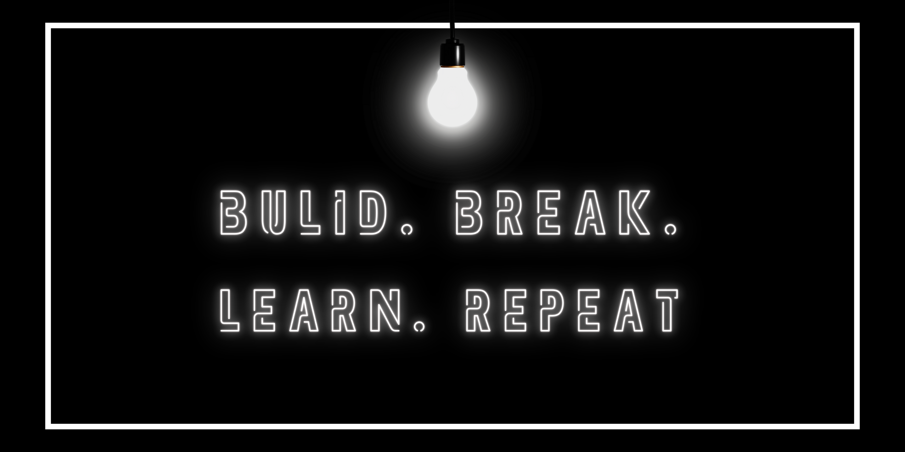

# Hey, I'm Satya 👋
🔭 I’m currently working as Full stack developer 🌱 I’m currently learning AI & ML 👨‍💻 Coding, learning and sometimes film buff 📍 Odia in Bengaluru

## 🌐 Socials:
   

# 💻 Tech Stack:
                    
# 📊 GitHub Stats:
 
 

## 🏆 GitHub Trophies

### ✍️ Random Dev Quote

### 🔝 Top Contributed Repo

---

<!-- Proudly created with GPRM ( https://gprm.itsvg.in ) -->
