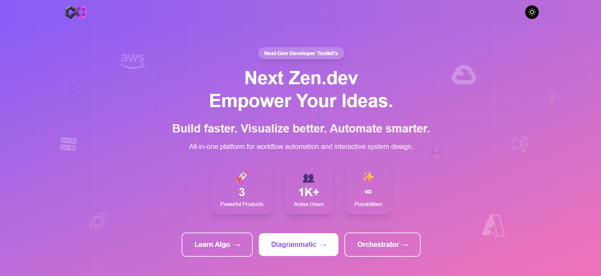

# Hey, I'm Satya 👋

**Full-stack developer** — building things that ship.  
🔭 I’m currently working as a **Full-stack Developer** · 🌱 learning **AI & ML** · 🎬 sometimes a film buff · 📍 **Bengaluru**  
🌐 [Portfolio](https://satya00089.github.io/portfolio/) · ✉️ <satyasubudhi089@gmail.com>

---

## About me
I write code, learn new tools, and enjoy building useful and delightful products. I focus on modern web stacks, backend APIs, and experimenting with ML pipelines. I love open source, problem solving, and good storytelling (whether in code or on screen).

**Current highlights**
- 🔭 Building web apps with **React / Node / FastAPI**  
- ⚙️ Running projects on **Vercel / AWS / Azure**  
- 🧠 Exploring model fine-tuning, ML pipelines, and MLOps

---

## 🌐 Socials
  
  

---

## 💻 Tech stack
    
    
    
  

---

## 📊 GitHub stats

  

 
 

### 🏆 Trophies

---

## 🎯 Goals
- Ship more end-to-end projects combining web + ML.  
- Contribute to meaningful open source (docs, bug fixes, features).  
- Learn model interpretability and MLOps best practices.

---

## 📫 Want to work / chat?
- Portfolio: https://satya00089.github.io/portfolio/  
- Email: satyasubudhi089@gmail.com  
- LinkedIn: https://linkedin.com/in/satya-subudhi

---
